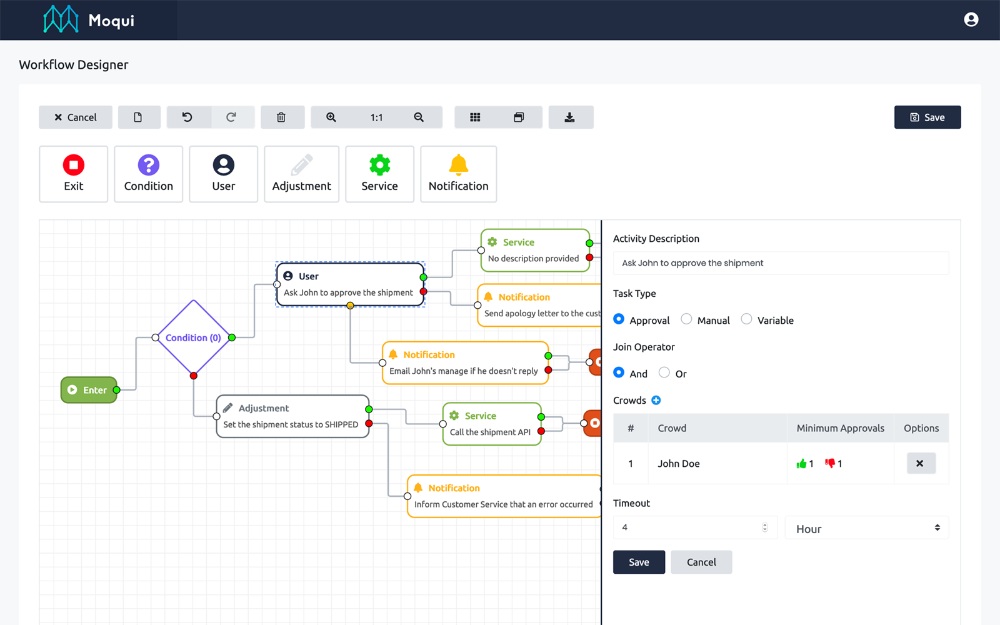

# Workflow Designer

Standalone Moqui workflow designer application based on Vue.js.



## Table of Contents

- [Installation](#installation)
- [Configuration](#configuration)
- [Authors](#authors)
- [License](#license)

## Installation

You will be carrying out these steps to install the workflow designer.

* Download the workflow designer
* Install dependencies & run workflow designer

### Download the workflow designer

Clone the workflow designer repository using this command:

```shell
$ git clone https://github.com/Netvariant/moqui-workflow.git
```

### Install dependencies & run workflow designer

The workflow designer uses NPM for dependency management. Install dependencies and run the workflow designer using these commands:

```shell
$ npm install
$ npm run serve
```

You can also build the project for production use using this command:

```shell
$ npm run build
```

> Remember, the user account you use to login must be a member of a group that has access to the `Moqui Workflow REST API` artifact group.

## Configuration

The workflow designer communicates with your Moqui instance using REST APIs. 
The base API URL path is configured in the `.env` file. 
All API requests are pass though a proxy to reach the Moqui instance, this is configured in the `vue.config.js` file.

```javascript
module.exports = {
    // ...
    proxy: {
        // proxy all requests starting with /rest/s1 to localhost:8080
        '/rest/s1': {
            target: 'http://localhost:8080',
            ws: true,
            changeOrigin: true
        }
    }
    // ...
}
```

See the [Configuration Reference](https://cli.vuejs.org/config/) for a detailed description of all available configuration options.

## Authors

This project was build with :heart: by the good fellas at [Netvariant](https://www.netvariant.com).

## License

[](https://github.com/Netvariant/moqui-workflow/blob/master/LICENSE.md)
 
This project is licensed under the CC0 License, see the [LICENSE.md](LICENSE.md) file for details.
